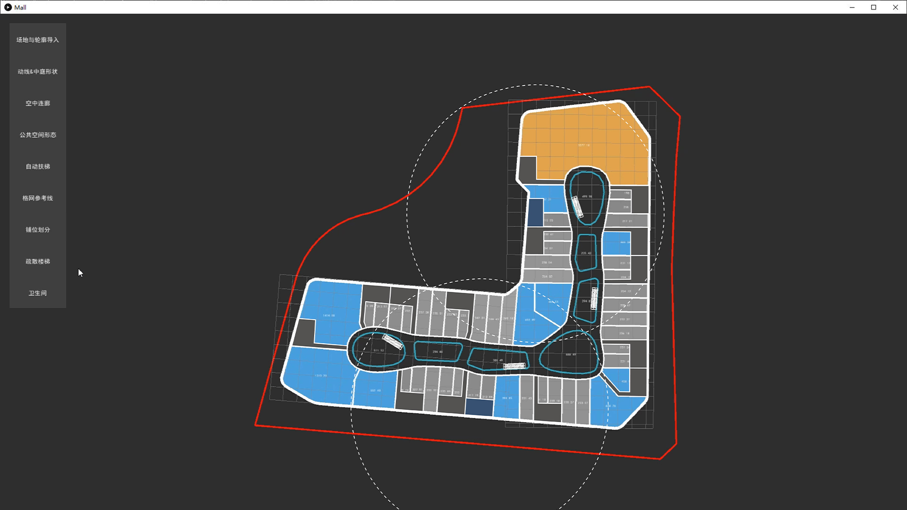
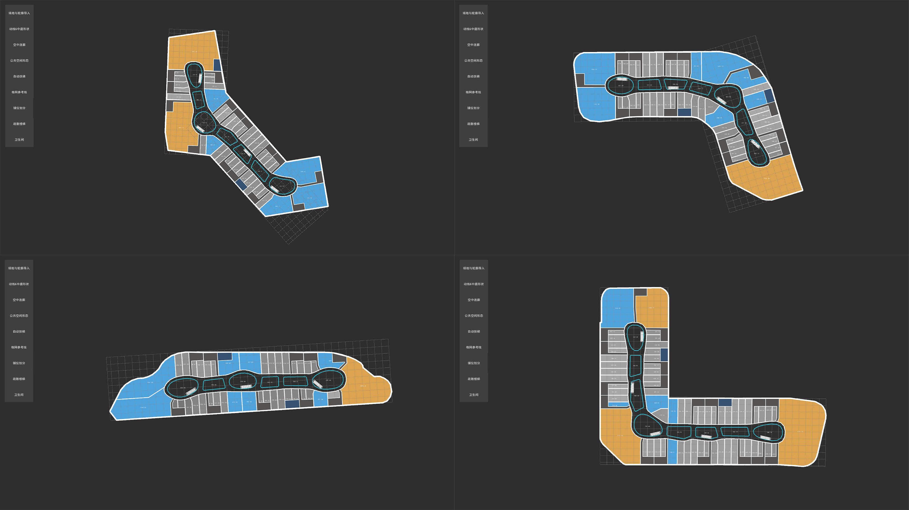

# Shopping Mall Planning Generator
2020-2021

Shopping Mall Planning Generator is a research project in cooperation with Shuishi Design Inc., aiming to digitize design patterns and provide a standardized scheme for the initial stage of commercial building design.

  
  
